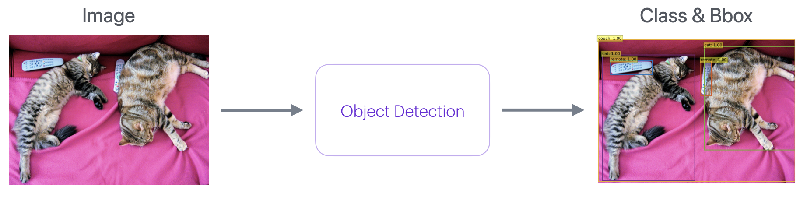
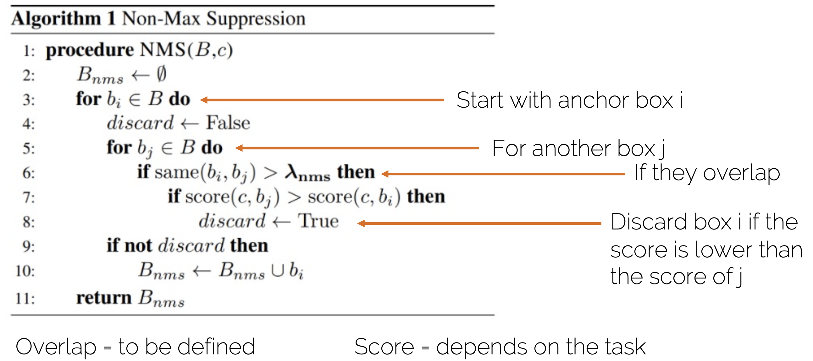
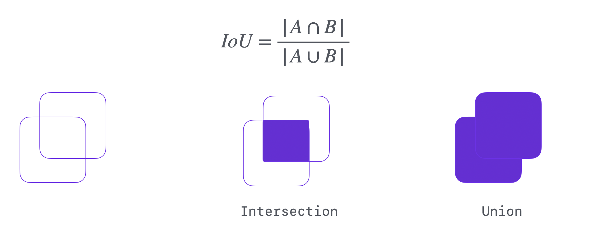
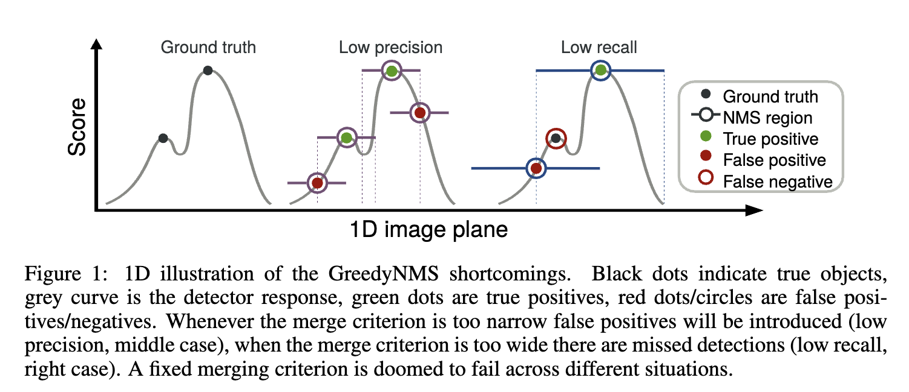
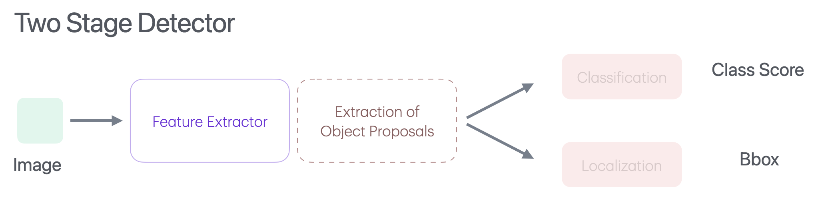
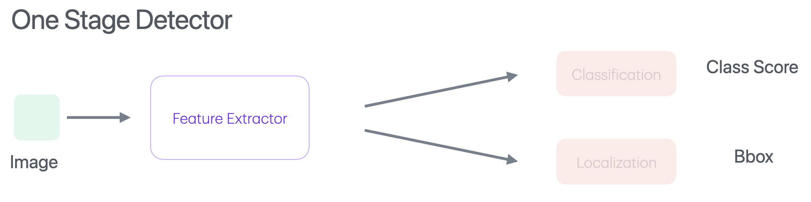

# Object Detection
The goal of object detection is to predict a set of bounding boxes(x,y,w,h) and category labels for each object of interest.

# Traditional
## Template Matching + Sliding Window
For every position you evaluate how much do the pixels in the image and template correlate.

**Cons**

1. Does not handle occlusions.
2. Works with instance of object but not with class of it.
3. Does not work if pose changes.
4. Does not work if position, scale and aspect ratio changes.

## Feature Extraction and Classification
Learn multiple weak classifier to build a strong final decision.

### Feature Extraction
**Viola-Jones Detector**

Haar Features

**Histogram of Oriented Gradients(HOGs)**
Compute gradients in dense grids, compute gradients and create a
histogram based on gradient direction

### Classification
It is done with the help of SVM.

## General Object Detection

- Class agnostic
- Object Proposals / Region of Intrest
    - [Selective search](detection/SelectiveSearch.md)
    - Edge boxes

### Non-Maxium Supression (NMS)

#### IoU
If two bbox ahve both Intersection and union high then the IoU will be high.
Assume two case :

1. Intersion is large but the bbox are also very large bbox this leads to very high union depicting same same object.
2. Intersion is large but the bbox are small bbox then possibly they are dipicting different object.

#### [$\lambda_{NMS}$](https://arxiv.org/pdf/1511.06437)
Do not allow the bbos if they are overlapping more than $\lambda_{NMS}$ threshold.

Narrrow Threshold (High IoU) : Low Precision (More False Positive)
Wide Threshold (Low IoU): Low Recall (More False Negative)

#### Localization

### Two-Stage Detector

- R-CNN, Fast R-CNN, Faster R-CNN
- SPP-Net, R-FCN, FPN

- [Overfeat](detection/Overfeat.md)
- [RCNN](detection/RCNN.md)

### One-Stage Detector

- YOLO, SSD, RetinaNet
- CenterNet, CornerNet, ExtremeNet

# Methods

- [SSD](detection/SSD.md)
- [YOLO](detection/YOLO.md)
- [RetinaNet](detection/RetinaNet.md)
- [DETR](detection/DETR.md)
- [Swin Transformer](detection/SwinTransformer.md)
- [DINO](detection/DINO.md)
- [InternImage](detection/InternImage.md)
- [OWL](detection/OWL.md)