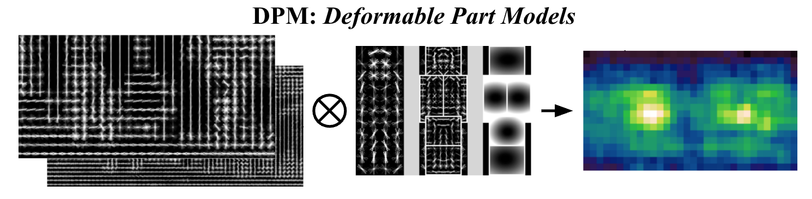
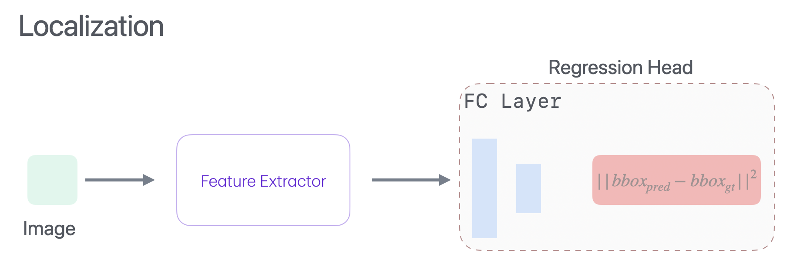

# Object Detection
# Content
1. [Introduction](#introduction)
2. [Metrices](https://github.com/rokmr/Machine-Learning/blob/main/notes/Metrices.md)
3. [Traditional](#traditional)
4. [General Object Detection](#general-object-detection)
    - [One-Stage Detector](#two-stage-detector)
    - [One-Stage Detector](#one-stage-detector)
    - [Transformer-Based Detector](#transformer-based-detector)

# Introduction
The goal of object detection is to predict a set of bounding boxes(x,y,w,h) and category labels for each object of interest.

# Traditional
## Template Matching + Sliding Window
For every position you evaluate how much do the pixels in the image and template correlate.

**Cons**

1. Does not handle occlusions.
2. Works with instance of object but not with class of it.
3. Does not work if pose changes.
4. Does not work if position, scale and aspect ratio changes.

## Feature Extraction and Classification
Learn multiple weak classifier to build a strong final decision.

### Feature Extraction
**Viola-Jones Detector**

Haar Features

**Histogram of Oriented Gradients(HOGs)**
Compute gradients in dense grids, compute gradients and create a
histogram based on gradient direction

**Deformable Part Model (DPM)** Based on HOG features but based on body part detection. More robust to different body poses.

### Classification
It is done with the help of SVM.

# General Object Detection

- Class agnostic
- Object Proposals / Region of Intrest
    - [Selective search](detection/SelectiveSearch.md)
    - Edge boxes

**Localization**

## Two-Stage Detector

- R-CNN, Fast R-CNN, Faster R-CNN
- SPP-Net, R-FCN, FPN

- [Overfeat](detection/Overfeat.md)
- [R-CNN, Fast R-CNN, Faster R-CNN, SPP-Net](detection/RCNN.md)

## One-Stage Detector

No need of Region Proposal Network

They are very fast

- YOLO, SSD, RetinaNet
- CenterNet, CornerNet, ExtremeNet

- [YOLO](detection/YOLO.md)
- [RetinaNet](detection/RetinaNet.md)
- [CornerNet](detection/CornerNet.md)
- [CenterNet](detection/CenterNet.md)
- [ExtremeNet](detection/ExtremeNet.md)

## Transformer-Based Detector
- [DETR](detection/DETR.md)

# Methods
- [Swin Transformer](detection/SwinTransformer.md)
- [DINO](detection/DINO.md)
- [InternImage](detection/InternImage.md)
- [OWL](detection/OWL.md)