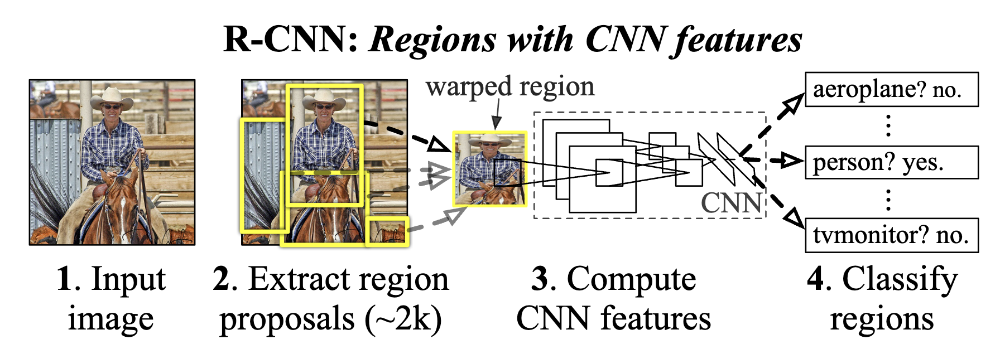
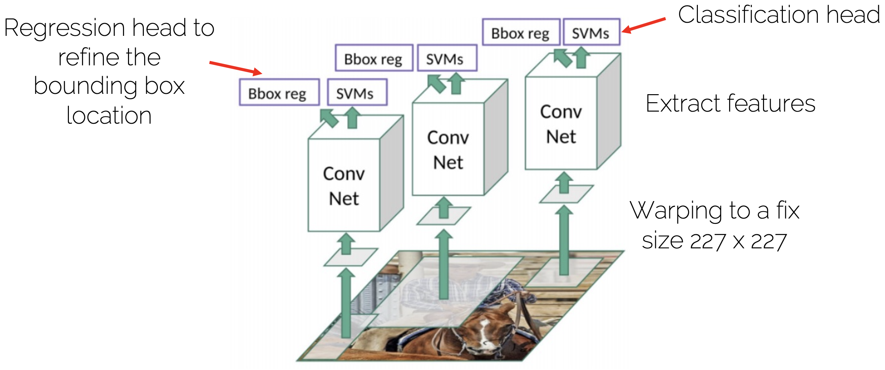
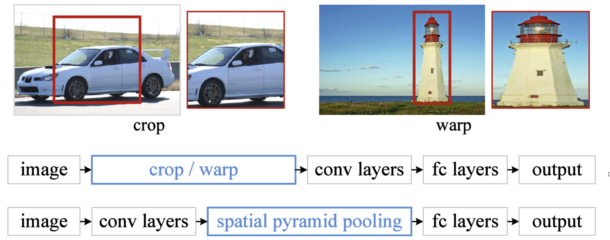
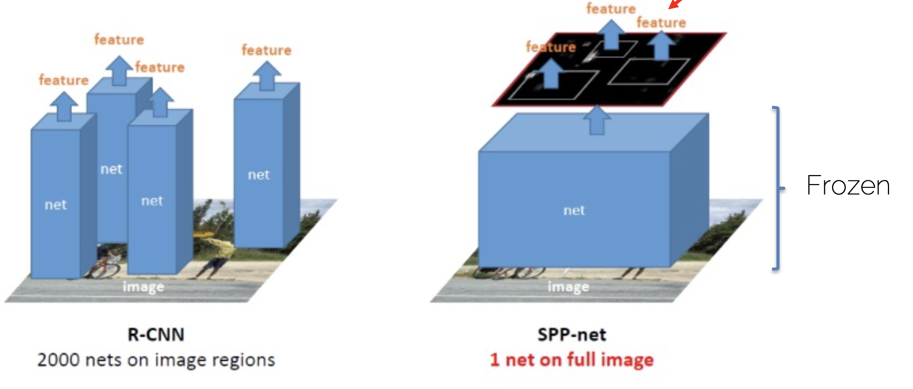
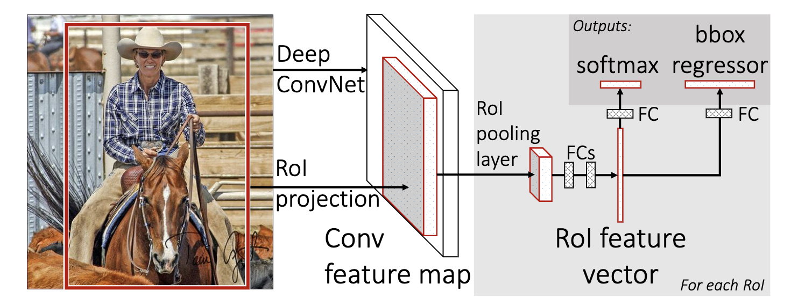
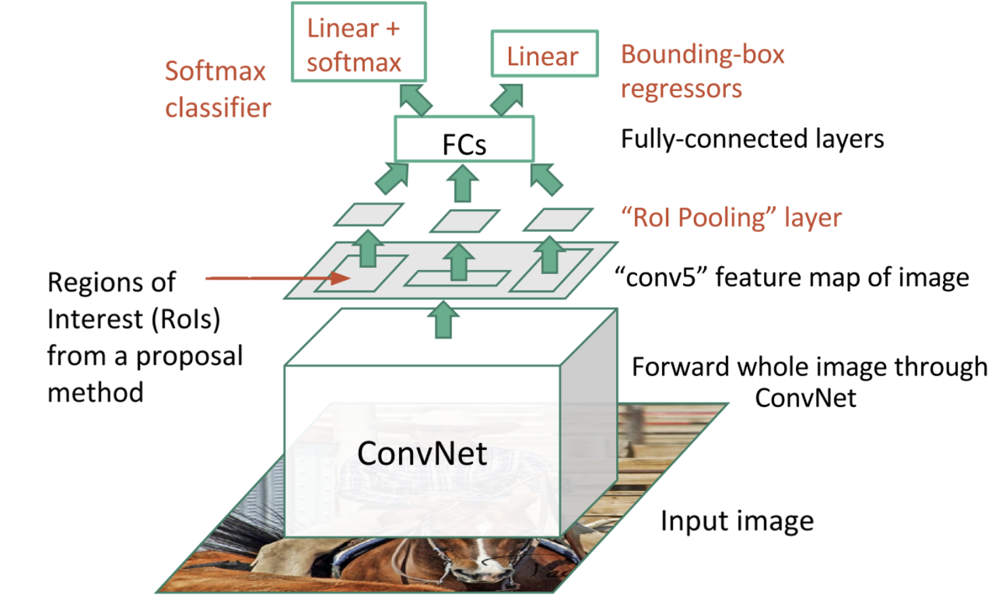

# [RCNN](https://arxiv.org/pdf/1311.2524)

Steps

1. Scan the input image for possible objects using an algorithm called Selective Search, generating ~2000 region proposals

2. Warp to a fix size 227 x 227

3. Run a convolutional neural net (CNN) on top of each of these region proposals

4. Make the output of each CNN and feed it into a) an SVM to classify the region and b) a linear regressor to tighten the bounding box of the object, if such an object exists.

## Training
1. Pre-train the CNN on ImageNet
2. Finetune the CNN on the number of classes the detector is aiming to classify (softmax loss).
3. Train a linear Support Vector Machine classifier to classify image regions. One SVM per class! (hinge loss)
4. Train the bounding box regressor (L2 loss)

**Cons**
1. If we have overlapping window then we will do ConvNet computation for each of the pixels more than 1 times. This increases extra computation.

2. Training is slow and complex(no end-to-end)

3. Region Proposal region is fixed

# [SPP Net](https://arxiv.org/pdf/1406.4729)

Makes the RCNN fast at test time.

Issues

1. Training is slow and complex(no end-to-end)

2. Region Proposal region is fixed

# [Fast RCNN](https://arxiv.org/pdf/1504.08083)

1. Performing feature extraction over the image before proposing regions, thus only running one CNN over the entire image instead of 2000 CNN’s over 2000 overlapping regions.
2. After conv5 there is FC layer we need to make all the deature size need to be of same size using RoI Pooling layer.

[RoI Pooling Layer Image]

# [Faster RCNN](https://arxiv.org/pdf/1506.01497)
